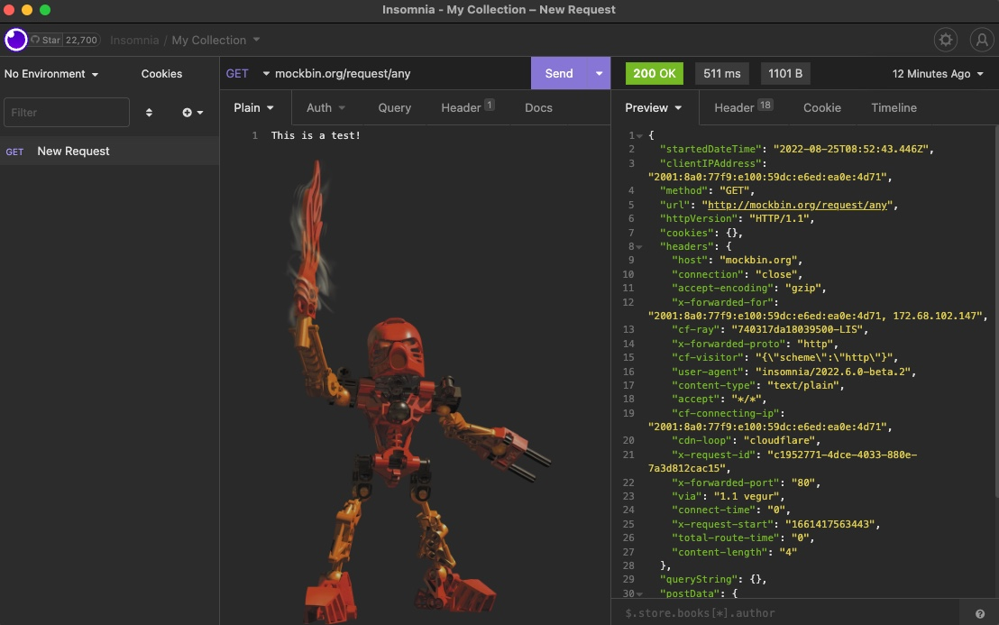
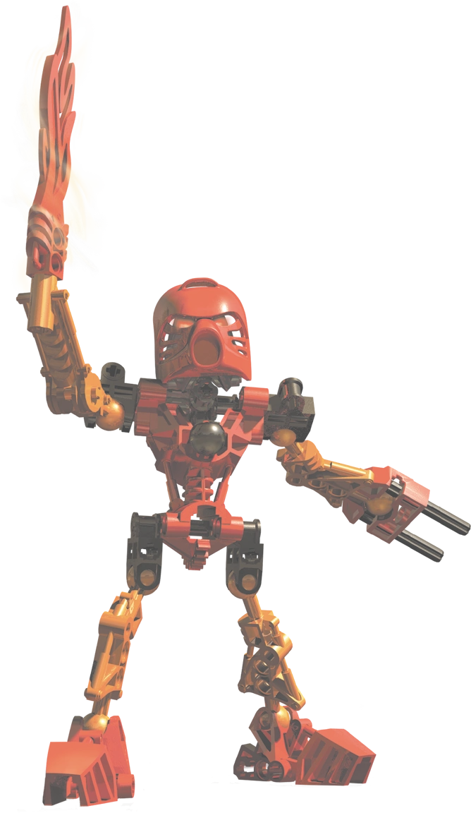

# Insomnia Bionicle theme

Theme for insomnia that is using default "Core Default" colors and adds Toa Tahu image to the left bottom corner.

Image can be changed by replacing `tahu.png` file (must have same name and format!)

Adapted from https://github.com/Kubas556/insomnia-plugin-luna-theme for example purposes

## Preview

## Image used in plugin

Repository adapted from https://github.com/Kubas556/insomnia-plugin-luna-theme
Image originally from : https://vsbattles.fandom.com/wiki/Tahu

> "United in Duty. Bound in Destiny. This is the way... of the Bionicle!"
> — Turaga Vakama, BIONICLE 2: Legends of Metru Nui
